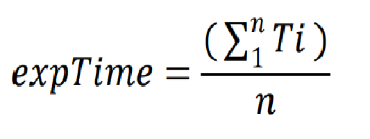
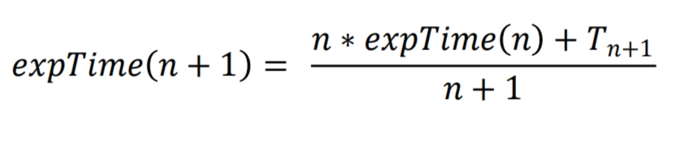
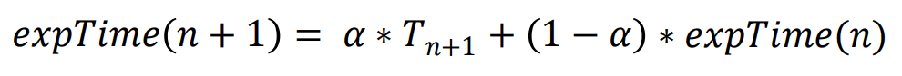
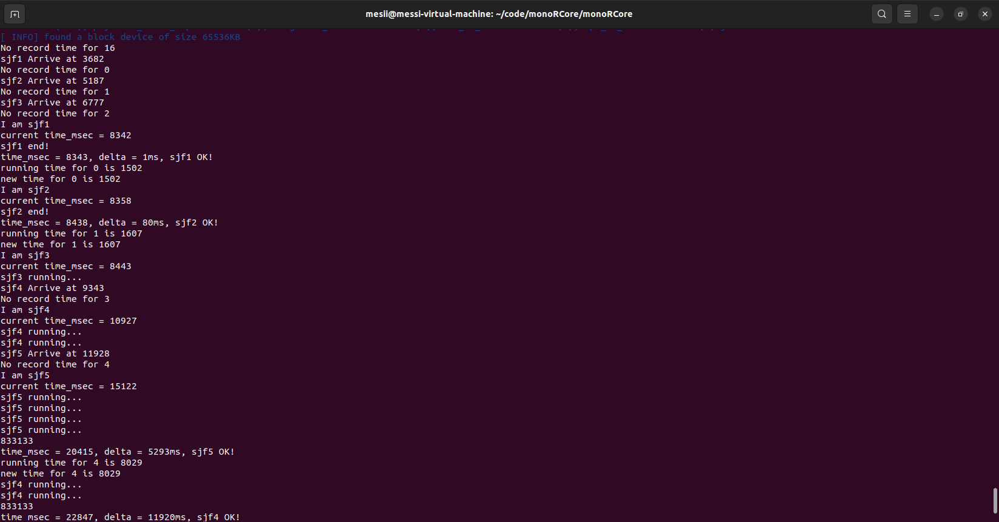
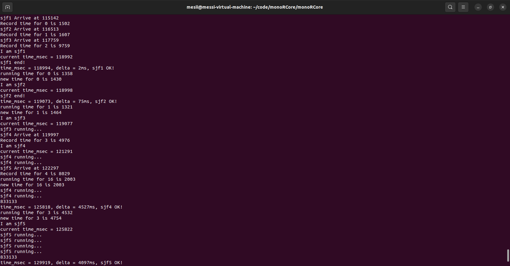
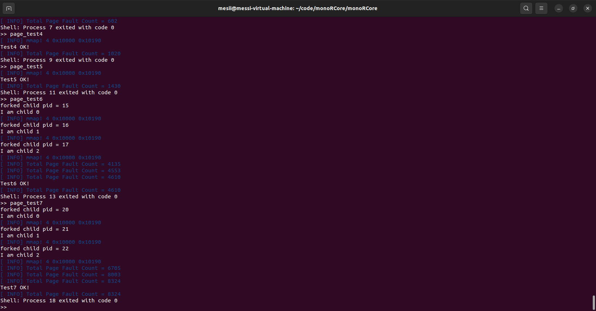
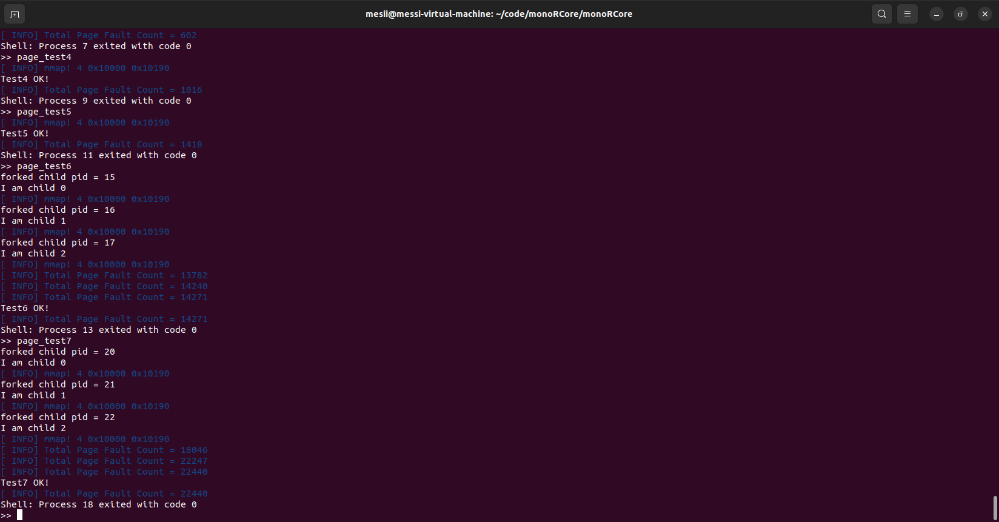
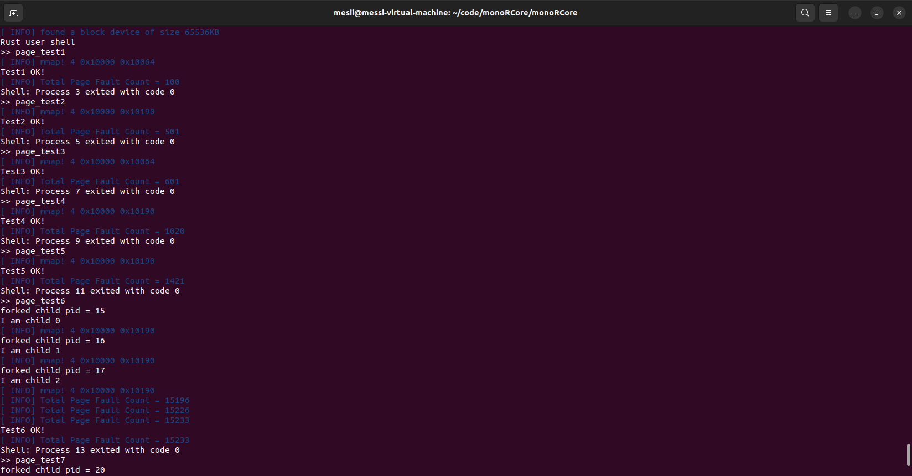
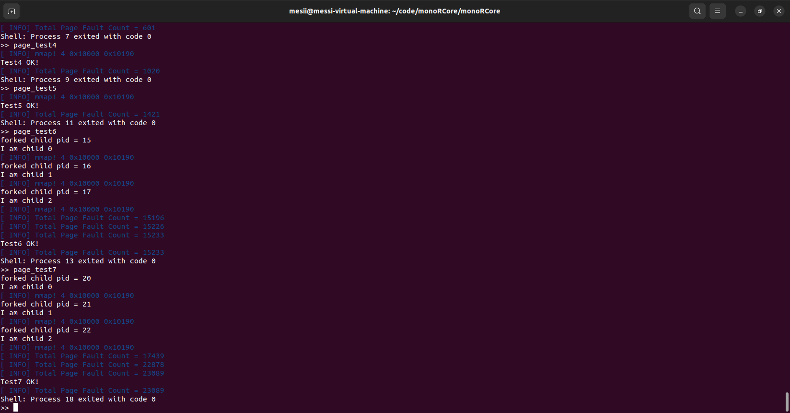

<!-- TOC -->

- [monoRCore调度算法和页面替换算法改进](#monorcore%E8%B0%83%E5%BA%A6%E7%AE%97%E6%B3%95%E5%92%8C%E9%A1%B5%E9%9D%A2%E6%9B%BF%E6%8D%A2%E7%AE%97%E6%B3%95%E6%94%B9%E8%BF%9B)
    - [代码学习](#%E4%BB%A3%E7%A0%81%E5%AD%A6%E4%B9%A0)
        - [任务管理模块](#%E4%BB%BB%E5%8A%A1%E7%AE%A1%E7%90%86%E6%A8%A1%E5%9D%97)
            - [sjf算法](#sjf%E7%AE%97%E6%B3%95)
            - [stcf算法](#stcf%E7%AE%97%E6%B3%95)
            - [hrrn算法](#hrrn%E7%AE%97%E6%B3%95)
            - [stride算法](#stride%E7%AE%97%E6%B3%95)
            - [Lottery算法](#lottery%E7%AE%97%E6%B3%95)
            - [edf算法](#edf%E7%AE%97%E6%B3%95)
            - [rms算法](#rms%E7%AE%97%E6%B3%95)
            - [mlfq算法](#mlfq%E7%AE%97%E6%B3%95)
        - [存储管理模块](#%E5%AD%98%E5%82%A8%E7%AE%A1%E7%90%86%E6%A8%A1%E5%9D%97)
            - [fifo算法](#fifo%E7%AE%97%E6%B3%95)
            - [clock算法](#clock%E7%AE%97%E6%B3%95)
            - [clock_improve算法](#clock_improve%E7%AE%97%E6%B3%95)
            - [Work_set算法](#work_set%E7%AE%97%E6%B3%95)
            - [pff算法](#pff%E7%AE%97%E6%B3%95)
    - [测试部分](#%E6%B5%8B%E8%AF%95%E9%83%A8%E5%88%86)
    - [改进计划](#%E6%94%B9%E8%BF%9B%E8%AE%A1%E5%88%92)
        - [修改sjf,stcf和hrrn算法的逻辑](#%E4%BF%AE%E6%94%B9sjfstcf%E5%92%8Chrrn%E7%AE%97%E6%B3%95%E7%9A%84%E9%80%BB%E8%BE%91)
            - [回答问题：任务调度算法的改进中，做持久化存储吗？历史数据是存储在内存中还是磁盘中？](#%E5%9B%9E%E7%AD%94%E9%97%AE%E9%A2%98%E4%BB%BB%E5%8A%A1%E8%B0%83%E5%BA%A6%E7%AE%97%E6%B3%95%E7%9A%84%E6%94%B9%E8%BF%9B%E4%B8%AD%E5%81%9A%E6%8C%81%E4%B9%85%E5%8C%96%E5%AD%98%E5%82%A8%E5%90%97%E5%8E%86%E5%8F%B2%E6%95%B0%E6%8D%AE%E6%98%AF%E5%AD%98%E5%82%A8%E5%9C%A8%E5%86%85%E5%AD%98%E4%B8%AD%E8%BF%98%E6%98%AF%E7%A3%81%E7%9B%98%E4%B8%AD)
            - [回答问题：估算每次任务的运行时间或许可以考虑进去整个系统的负载情况，通过整个系统中有多少个任务正在运行来衡量。](#%E5%9B%9E%E7%AD%94%E9%97%AE%E9%A2%98%E4%BC%B0%E7%AE%97%E6%AF%8F%E6%AC%A1%E4%BB%BB%E5%8A%A1%E7%9A%84%E8%BF%90%E8%A1%8C%E6%97%B6%E9%97%B4%E6%88%96%E8%AE%B8%E5%8F%AF%E4%BB%A5%E8%80%83%E8%99%91%E8%BF%9B%E5%8E%BB%E6%95%B4%E4%B8%AA%E7%B3%BB%E7%BB%9F%E7%9A%84%E8%B4%9F%E8%BD%BD%E6%83%85%E5%86%B5%E9%80%9A%E8%BF%87%E6%95%B4%E4%B8%AA%E7%B3%BB%E7%BB%9F%E4%B8%AD%E6%9C%89%E5%A4%9A%E5%B0%91%E4%B8%AA%E4%BB%BB%E5%8A%A1%E6%AD%A3%E5%9C%A8%E8%BF%90%E8%A1%8C%E6%9D%A5%E8%A1%A1%E9%87%8F)
        - [添加新算法](#%E6%B7%BB%E5%8A%A0%E6%96%B0%E7%AE%97%E6%B3%95)
            - [LRU替换算法](#lru%E6%9B%BF%E6%8D%A2%E7%AE%97%E6%B3%95)
            - [LFU替换算法](#lfu%E6%9B%BF%E6%8D%A2%E7%AE%97%E6%B3%95)
            - [NRU替换算法（已经根据wiki内容修正）](#nru%E6%9B%BF%E6%8D%A2%E7%AE%97%E6%B3%95%E5%B7%B2%E7%BB%8F%E6%A0%B9%E6%8D%AEwiki%E5%86%85%E5%AE%B9%E4%BF%AE%E6%AD%A3)
    - [实现方式](#%E5%AE%9E%E7%8E%B0%E6%96%B9%E5%BC%8F)
        - [时间记录](#%E6%97%B6%E9%97%B4%E8%AE%B0%E5%BD%95)
            - [历史平均记录预测](#%E5%8E%86%E5%8F%B2%E5%B9%B3%E5%9D%87%E8%AE%B0%E5%BD%95%E9%A2%84%E6%B5%8B)
            - [平滑系数记录预测](#%E5%B9%B3%E6%BB%91%E7%B3%BB%E6%95%B0%E8%AE%B0%E5%BD%95%E9%A2%84%E6%B5%8B)
            - [具体运行流程](#%E5%85%B7%E4%BD%93%E8%BF%90%E8%A1%8C%E6%B5%81%E7%A8%8B)
        - [页面替换算法](#%E9%A1%B5%E9%9D%A2%E6%9B%BF%E6%8D%A2%E7%AE%97%E6%B3%95)
            - [LRU替换算法](#lru%E6%9B%BF%E6%8D%A2%E7%AE%97%E6%B3%95)
            - [LFU替换算法](#lfu%E6%9B%BF%E6%8D%A2%E7%AE%97%E6%B3%95)
            - [NRU替换算法](#nru%E6%9B%BF%E6%8D%A2%E7%AE%97%E6%B3%95)
    - [测试结果](#%E6%B5%8B%E8%AF%95%E7%BB%93%E6%9E%9C)
        - [时间预测测试](#%E6%97%B6%E9%97%B4%E9%A2%84%E6%B5%8B%E6%B5%8B%E8%AF%95)
        - [页面替换算法测算结果](#%E9%A1%B5%E9%9D%A2%E6%9B%BF%E6%8D%A2%E7%AE%97%E6%B3%95%E6%B5%8B%E7%AE%97%E7%BB%93%E6%9E%9C)
            - [LRU](#lru)
            - [LFU](#lfu)
            - [NRU](#nru)

<!-- /TOC -->

# monoRCore调度算法和页面替换算法改进

<p>代码基于清华大学贾悦婷学姐的毕业设计，源代码为清华大学计算机操作系统实验课程的代码。代码原为rcore-Turtorail，由rust语言进行编写，monoRCore将其进行了模块化，降低代码之间的耦合性。贾学姐在完成实验代码的基础上，对monoRCore的调度算法进行了拓展，添加了sjf、stcf、hrrn等任务调度算法和fifo、clock、workset等页面切换算法。我将在贾学姐的基础上，进行一定的算法改进和拓展。


## 代码学习
<p>monoRCore为清华大学为了进行操作系统学习而开发的一款简易的操作系统，其原型为rCore_tutorial，monoRCore在其基础上进行了模块化封装，使其可以直接被多个实验共享而不需要同学们在操作时修改分支。
在monoRCore中主要包含八个部分，分别为：

<li>  syscall模块（处理系统模块）
<li>  task-manage模块（任务管理器模块）
<li>  kernel-alloc模块（内核存储分配模块）
<li>  kernel-context模块（任务上下文模块）
<li>  kernel-vm模块（虚拟存储模块）
<li>  signal模块（信号处理器）
<li>  easy-fs模块（文件系统）
<li>  sync模块（同步模块）
<br>
<br>
<p>在这些模块中需要同学们按照实验步骤添加一些功能，以最终实现一个完整的操作系统。由于我工作的重心是任务调度和存储管理，所以主要介绍一下这两个模块。

### 任务管理模块
<p>monoRCore的任务管理器处于task-manage模块中，模块中有两种通用任务管理器，分别定义启用线程和不启用线程时的任务管理。调度代码写在schedule模块内，提供了一个Manage接口和Schedule接口：

```rust
pub trait Manage<T, I: Copy + Ord> {
    /// 插入 item
    fn insert(&mut self, id: I, item: T);
    /// 删除 item
    fn delete(&mut self, id: I);
    /// 获取 mut item
    fn get_mut(&mut self, id: I) -> Option<&mut T>;
}
```

```rust
pub trait Schedule<I: Copy + Ord> {
    /// 入队
    fn add(&mut self, id: I);
    /// 出队
    fn fetch(&mut self) -> Option<I>;
    
    /// info update
    fn update_exec(&mut self, id: I, args: &ExecArgs);
    /// copy info for fork
    fn update_fork(&mut self, parent_id: I, child_id: I);
    /// sleep update
    fn update_sleep(&mut self, id: I);

    /// kernel hook
    fn update_sched_to(&mut self, id: I, time: usize);
    fn update_suspend(&mut self, id: I, time: usize);
}
```
当然，原本的monoRCore中的schedule的接口仅有add和fetch两个接口函数，这两个接口对于时间片轮转调度已经够了，为了实现更高级的调度算法，就需要添加一些其他的接口函数。

#### sjf算法
对于sjf调度，开发者采用了如下数据结构：
```rust
struct SJFTaskBlock<I: Copy + Ord> {
    task_id: I,
    time: usize
}
```
```rust
pub struct SJFManager<T, I: Copy + Ord> {
    tasks: BTreeMap<I, T>,
    time_map: BTreeMap<I, usize>,
    heap: BinaryHeap<SJFTaskBlock<I>> // max-heap, reverse Ord to get a min-heap
}
```
这里用map实现了一个由taskId向time的映射，来存储每个task运行的时间，并用一个反转的大顶堆来实现调度队列。

#### stcf算法
对于stcf调度，开发者采用如下数据结构：
```rust
struct STCFTaskBlock<I: Copy + Ord> {
    task_id: I,
    time_total: isize,
    time_left: isize
}
```
```rust
pub struct STCFManager<T, I: Copy + Ord> {
    tasks: BTreeMap<I, T>,
    time_map: BTreeMap<I, (isize, isize)>, // (time_total, time_left)
    heap: BinaryHeap<STCFTaskBlock<I>>,
    current: Option<(I, usize)>  // (id, st_time)
}
```
同样用map实现了执行时间和任务号的映射，不过time_map里存储的是运行时间和剩余时间。调度器也要记下来当前任务的开始时间，在进行suspend操作时要对任务更新任务当前剩余运行时间，即用当前时间减去开始时间即可得到运行的时间。

#### hrrn算法
hrrn数据结构如下
```rust
struct HRRNTaskBlock<I: Copy + Ord> {
    task_id: I,
    time_total: usize,
    time_wait: usize,
    last_stop_time: usize,
    is_ready: bool
}
```
```rust
pub struct HRRNManager<T, I: Copy + Ord> {
    tasks: BTreeMap<I, T>,
    info_map: BTreeMap<I, HRRNTaskBlock<I>>,
    current: Option<I> // (id, st_time)
}
```
这里要用当前时间减去上一次休眠的时间再加上已经等待的时间来计算响应比。

#### stride算法
stride算法数据结构如下
```rust
struct StrideBlock<I: Copy + Ord> {
    task_id: I,
    priority: usize,
    stride: usize
}
```
```rust
pub struct StrideManager<T, I: Copy + Ord>{
    tasks: BTreeMap<I, T>,
    info_map: BTreeMap<I, StrideBlock<I>>,
    heap: BinaryHeap<StrideBlock<I>>,
    current: Option<I>
}
```
这里用一个map来映射优先级和stride信息，在运行时初始的stride为0，每次进行suspend操作就给当前task的stride循环相加BIG_STRIDE/priority。

#### Lottery算法
lottery算法数据结构如下
```rust
struct LotteryBlock {
    priority: usize,
    is_ready: bool
}
```
```rust
pub struct LotteryManager<T, I: Copy + Ord> {
    tasks: BTreeMap<I, T>,
    info_map: BTreeMap<I, LotteryBlock>,
    total_count: usize,
    rng: ChaCha20Rng
}
```
这里用priority来记录每个任务所带有的彩票数，total_count来记录总的彩票数，用rng随机生成一个彩票号（范围在0-total_count - 1）来决定当前要调度的任务，如果当前任务的彩票数+之前没能中彩票的任务的彩票数的总和大于彩票号，就说明当前任务中彩票了，可以调度该任务。每次对当前任务进行一次suspend操作，就要减掉当前任务的彩票数目，以保证彩票数正确。

#### edf算法
edf算法的数据结构如下
```rust
struct EDFBlock<I: Copy + Ord> {
    task_id: I,
    period: isize,
    init_ddl: isize,
    next_ddl: isize
}
```
```rust
pub struct EDFManager<T, I: Copy + Ord> {
    tasks: BTreeMap<I, T>,
    info_map: BTreeMap<I, EDFBlock<I>>,
    heap: BinaryHeap<EDFBlock<I>>
}
```
这里用一个结构体记录任务的要运行的周期数，初始的截止时间和下一次的截止时间，每次取任务时，都要用当前的时间减去之前的ddl来算出经过的时间，并除以周期+1来算出下一次的ddl。

#### rms算法
rms算法的数据结构如下
```rust
struct RMSBlock<I: Copy + Ord> {
    task_id: I,
    period: isize
}

```
```rust
pub struct RMSManager<T, I: Copy + Ord> {
    tasks: BTreeMap<I, T>,
    period_map: BTreeMap<I, isize>,
    heap: BinaryHeap<RMSBlock<I>>
}
```
这里用一个结构体记录任务的要运行的周期数，初始的截止时间和下一次的截止时间，每次取任务时，都要用当前的时间减去之前的ddl来算出经过的时间，并除以周期+1来算出下一次的ddl。

#### mlfq算法
mlqf算法数据结构如下
```rust
pub struct MLFQManager<T, I: Copy + Ord> {
    tasks: BTreeMap<I, T>,
    priority_map: BTreeMap<I, usize>, // 0 for max priority, 15 min
    queues: VecDeque<LinkedList<I>>,
    cur_giveup: bool
}
```
在这里用queues来存储一个多级队列，每个任务根据其优先级存在对应的队列中，每次执行时从最高等级队列中取出第任务进行处理。如果任务主动休眠，则任务优先级不变（用cur_giveup来表示是否进行了主动休眠），否则将任务优先级下降一级。

### 存储管理模块
monoRCore的存储管理主要涉及kernel-alloc模块和kernel-vm模块，alloc负责内核堆空间的分配和回收，vm模块则负责虚拟地址管理，由于页面管理主要是虚拟地址空间负责的，所以重心放在vm模块上。
在vm模块中定义了AddressSpace结构体，包含当前任务的地址空间对应的页表和所有的虚拟内存。，每次申请一块虚拟地址空间时，需要在AddressSpace中添加该空间的映射，释放一块虚拟空间时，要去除对应的映射。这些操作通过syscall进行的mmap和munmap实现。
为了实现特定的调度算法，需要添加frame-manage模块，对应的接口如下：
```rust
pub trait Manage<Meta: VmMeta, M: PageManager<Meta> + 'static> {
    fn new() -> Self;

    fn handle_pagefault<F>(&mut self, get_memory_set: &F, vpn: VPN<Meta>, task_id: usize)
        where F: Fn(usize) -> &'static mut AddressSpace<Meta, M>;

    fn work<F>(&mut self, get_memory_set: &F, task_id: usize) -> Vec<(PPN<Meta>, VPN<Meta>, usize)>  //  ppn, vpn, task_id
        where F: Fn(usize) -> &'static mut AddressSpace<Meta, M>;

    fn insert_frame(&mut self, vpn: VPN<Meta>, ppn: PPN<Meta>, task_id: usize, frame: FrameTracker);

    fn clear_frames(&mut self, task_id: usize); // clear all frames related to certain task, called when the task exit

    fn handle_time_interrupt<F>(&mut self, get_memory_set: &F) 
        where F: Fn(usize) -> &'static mut AddressSpace<Meta, M>;
}
```

#### fifo算法
fifo置换算法如下
```rust
pub struct FIFOManager<Meta: VmMeta, M: PageManager<Meta>> {
    queue: BTreeMap<usize, VecDeque<(PPN<Meta>, VPN<Meta>, FrameTracker)>>,
    manager: PhantomData<M>
}
```
这里用一个map来存储存储每个task对应的AddressSpace，每次要进行替换时，找到当前的task对应的地址空间，并取出列表中的第一项，将其替换到辅存中。

#### clock算法
clock置换算法如下
```rust
pub struct ClockManager<Meta: VmMeta, M: PageManager<Meta>> {
    queue: BTreeMap<usize, ClockQueue<Meta>>,
    dummy: PhantomData<M>
}
```
同样是用map来存储信息，不过存储的是每个VmMeta对应的时钟信息：
```rust
pub struct ClockQueue<Meta: VmMeta> {
    pub inner: VecDeque<(PPN<Meta>, VPN<Meta>, FrameTracker)>,
    pub ptr: usize
}
```
这里为了能够在clock_improve算法里复用，所以在clock_queue中定义了一个ClockQueue的数据结构，用一个ptr来指向当前的页面，每次指向一个页面时先检查其访问位是否为1，如果为1则置0，否则将当前页面替换，像时钟一样循环往复。

#### clock_improve算法
具体操作和clock算法类似，但是这里对去看当前页表项的dirty位（即是否被修改），如果查找到一个dirty位为false的页面，就直接替换，这样可以节省页面替换时的开销。

#### Work_set算法
```rust
pub struct WorkSetManager<Meta: VmMeta, M: PageManager<Meta> + 'static> {
    queue: BTreeMap<usize, VecDeque<(VPN<Meta>, PPN<Meta>, FrameTracker)>>, // key = task_id
    workset: VecDeque<BTreeSet<(usize, VPN<Meta>)>>,
    ptr: usize,

    dummy: PhantomData<M>
}
```
这里用workset来存储当前ptr对应的工作集的数量，每次调度前，先计算当前的工作集，并将每个任务对应的不在工作集中的那些页面找出来，将这些页面清除。

#### pff算法
```rust
pub struct PffManager<Meta: VmMeta, M: PageManager<Meta> + 'static> {
    queue: BTreeMap<usize, VecDeque<(PPN<Meta>, VPN<Meta>, FrameTracker)>>, // key = task_id
    last_pgfault: usize, // timestamp
    dummy: PhantomData<M>
}
```
这里用last_pgfault来记录上一次缺页异常发生的时间，如果现在的时间减去之前的时间大于缺页异常的时间戳，则将该时间戳内未引用的页面从工作集里删除，否则仅仅将缺的页加入到工作集中。

## 测试部分
在user文件夹下有每个调度算法的测试样例文件，并在[算法名]+test.rs文件中利用exec_with_args函数调用当前的算法的测试样例，用以调度当前算法的调度测试。
```rust
static TESTS: &[&str] = &[
    "sjf1",
    "sjf2",
    "sjf3",
    "sjf4",
    "sjf5",
];
```
这里定义了一个list来存储当前算法的测试用例的路径，如果测试用例有其他的测试参数也可以定义在其他的list中，并将其定义在相同的index下。调度时在for循环里利用fork函数创建子进程，并在子进程中调用exec_with_args函数来启动测试用例。
```rust
    for test in TESTS {     
        let start = get_time();
        println!("{} Arrive at {}", test, start);
        let pid = fork();
        if pid == 0 {
            exec_with_args(*test, (&PRIORITY[i]) as *const _ as usize);
            panic!("unreachable!");
        }
        i += 1;
    }
```
在该文件夹的case.toml文件下包含了不同调度算法需要的编译的测试样例。

## 改进计划

### 修改sjf,stcf和hrrn算法的逻辑
<p>在monoRCore系统中，sjf、stcf、hrrn算法是三类和运行时间相关的算法，这些算法的运行目标是降低计算机的响应比，使算法更为高效。但是，由于设计的部分问题，它们在运行中会有一定的疏漏，比如原设计中，算法的调度时用的预计运行时间是用户自己设定的，这其实导致一定的系统漏洞：倘若一个运行时间很长的任务，在执行前用户给它设定的运行时间非常短的话，就会造成本该在后面执行的任务提前被调度，严重影响这些算法的实际效益。
<p>为了避免这种情况，任务的运行时间应当由系统判断给出。我认为可以用历史经验来测算。在系统中添加一个任务到历史运行时间的映射，在第一次调用时可以用用户自己给出的时间来进行运算，但在有过运行数据后，就应当以系统记录的历史运行时长为准。                                                              
<p>历史经验测算可以用如下两种方式进行：
<ol>
<li>记录每一次的运行时间，对其求平均，来获取当前预计的时间，测算公式如下：

<p>其中n为运行次数，Ti为每次运行的时间。
<p>当然这种算法的会导致占用比较多的系统空间，所以在观察这个公式的特性后，可以用如下公式来代替：

<p>expTime(n)为第n次运行后测算出来的时间。
<p>这时我们只需要记录每次预测的结果和运行的次数就可以进行预测了。
<li>指数平滑法，测算公式如下：

<p>a为平滑参数，范围在（0,1）之间，a越趋向于1，则预测时间会对时间序列的波动反应更为及时；而a越趋向于0，则预测时间会比较平稳。
</ol>
<p>两种算法在任务时间比较平滑时，预测的运行时间比较接近真实结果。第一种算法会给每次的运行时间相同的权值，相对来说比较公平，但是会逐渐削弱新的测试时间的影响，倘若系统进行了升级而速度变快或者系统因为时间久了运行变慢，历史运行时间的参考意义就没有那么重要了，这时需要给新的运行时间更多的权值。当任务的运行时间出现周期性波动或者无规则波动时，两者就无法做出比较准确的判断。

#### 回答问题：任务调度算法的改进中，做持久化存储吗？历史数据是存储在内存中还是磁盘中？
这里准备将两种算法都加入其中，在编译时根据配置项来进行选择预测算法。时间测算记录的结果是写在内存中的，并不作永久化存储。因为monoRCore的文件系统并不完善，没有永久化存储文件的镜像，且当前代码的很多文件接口并未完善，若以后有时间可以对其进行一定的完善操作。~~（当然也可以在另一个文件中写入并在运行时进行更改，但由于rsicv不支持rust的std库所以也无法实现，而且这种做法是在当前机器以外的地方进行存储，有点不太符合操作系统实验的要求。）~~

#### 回答问题：估算每次任务的运行时间或许可以考虑进去整个系统的负载情况，通过整个系统中有多少个任务正在运行来衡量。
对于当前cpu负载对任务运行时间的影响，其实没有考虑的必要。因为这些算法的参考指标是当前任务在cpu上运行的时间之合，而不是当前任务从开始运行的到结束所用的时间。而且即便考虑了负载的影响，那么当前任务的运行时间也和调度队列的操作相关，这样就形成一个循环依赖，并不是很合理。

### 添加新算法

#### LRU替换算法
<p>Least Recent Used算法是找到最近使用的页面里最久未被使用的页面，在出现缺页异常的时候将其替换掉。这种算法来源于程序的空间局部性，即当前正在使用的空间，在不久后很有可能会再次被使用，而许久未被使用的空间，很可能后面就不会再用到了。学姐已经实现的work-set算法其实也是这种思想的体现，但是work-set的不同之处在于它会将所有一段时间内未被使用的页面全部被替换，而且还要每经过调度一次就要计算work-set，对cpu和磁盘的压力比较大，而LRU替换算法只有在出现缺页异常的时候会去进行页面替换，会相对比较好运作。LRU算法比较接近OPT算法的结果，当然由于未来数据和历史数据没有绝对相关性，性能是无法完全达到opt算法的效果的。
<p>这里可以给每个页面设置一个unsigned的flag值，每次用到这个页面的时就把这个数值的最高位置1，并将其他页面的flag向右移一位，在需要调度的时候找到flag值最小的界面将其替换出去即可。

#### LFU替换算法
<p>Least Frequently Used算法基本思想和LRU类似，不过这里替换的原则是被使用次数最少的界面，没调用一次就给当前页面的调用计数器加一。出现缺页异常时，去找当前调用次数最少的页面，并将其更换掉。总的来说LFU在替换效果上要优于LRU，但是会导致更多的内存消耗和替换查找时间消耗。

#### NRU替换算法（已经根据wiki内容修正）
<p>Not recently used算法会给页面一个referenced位，每次访问该界面的时候就会把referenced设置为1，同时也会给该页面设置一个modified位（可以用dirty位来代替），每次修改当前页面内容就赋值为1。每次产生一次时钟中断就会把所有页面的reference位设置为0，这样就可以让在时钟中断周期内被访问过的页面reference位为1而其余页面reference位为0。当出现缺页中断时，操作系统把当前所有的页面分为四类（优先级由高到低）：
<ol>
<li>referenced, modified
<li>referenced, not modified
<li>not referenced, modified
<li>not referenced, not modified
</ol>
尽管一个页面似乎不大可能被修改但是没被引用，但是因为我们的引用符会在时间中断发生时被修改为0，所以这种情况在算法中式存在的。NRU会随机从当前优先级最低的类中选取一个页面，将其替换。

## 实现方式

### 时间记录
<p>抽象接口代码如下：

```rust
pub trait Record {
    fn update(&mut self, new_time: usize); //更新记录时间

    fn get_time(&self) -> usize; //获取预测时间
}
```
```rust
pub trait RecordMap<I> {
    fn insert(&mut self, proc:usize, record:I);//插入时间记录

    fn get_record(&mut self, proc:usize) ->Option<&mut I>;//获取时间记录
}
```
record特征用来存储对应的时间记录，map是时间记录的查找表。（由于riscv不允许使用std库，所以无法实现哈希表存储，这里用一个usize类型来表示不同的程序的键值。）

#### 历史平均记录预测
数据结构如下
```rust
pub struct HistoryRecord {
    exp_time: usize,
    exec_time: usize,
}
```
<p> exp_time表示预测时间，exec_time表示执行时间，每次运行后通过update函数进行更新，exec_time自增一次，exp_time通过之前的公式进行更新。

#### 平滑系数记录预测
数据结构如下
```rust
pub struct FactorRecord {
    exp_time: usize,
    factor: usize,
}
```
factor用来表示平滑系数，当然实际的a = factor/100,所以factor的大小应该在（0，100）这个区间。

#### 具体运行流程
<ol>
<li>在update_exec函数中，会根据ExecArgs中的proc参数来查找记录表中对应的时间记录，如果找到对应的时间记录就会在时间记录表中根据taskId插入对应的记录表，否则用用户自己设定的时间进行代替，并把taskId和proc的对应记录插入到对应记录表。
<li>每次进行update_sched_to函数操作是，将scheduler中的start_time设置为当前的time。
<li>进行update_suspend函数，用当前时间减去start_time就可以得到当前程序在这段时间运行的时间长度，并将这段时间长度加到当前任务的总运行时间上，就可以获得截止当前时间，该程序运行的时间。
<li>在程序结束的时候会delete函数，将对应taskId的任务的运行时间来更新taskId对应的proc的时间记录。
</ol>

### 页面替换算法
#### LRU替换算法
```rust
pub struct LFUManager<Meta:VmMeta,M:PageManager<Meta>> {
    queue: BTreeMap<usize, LfuQueue<Meta>>,
    manager: PhantomData<M>
}
```
```rust
pub struct LruQueue<Meta: VmMeta> {
    pub inner: VecDeque<(PPN<Meta>, VPN<Meta>, FrameTracker, u16)>,
}
```
<p>由于原来的页表项代码是在在在线仓库里，本人没有权限对其进行修改，这里实现的是一个近似的LRU替换算法。这里只用一个VecDeque来存储每个虚拟页表项对应的LRU flag，对于这个队列，有如下操作：

```rust
impl <Meta: VmMeta> LruQueue<Meta> {
    fn get_pte<M: PageManager<Meta>>(memory_set: &mut AddressSpace<Meta, M>, vpn: &VPN<Meta>) -> Option<Pte<Meta>> {
    }//获取对应页表项

    fn has_accessed<M: PageManager<Meta>>(memory_set: &mut AddressSpace<Meta, M>, vpn: &VPN<Meta>) -> bool {
    }//查看对应当前页表项的access位是否为1

    fn clear_accessed<M: PageManager<Meta>>(memory_set: &mut AddressSpace<Meta, M>, vpn: &VPN<Meta>) {
    }//清除页表项
}

impl <Meta: VmMeta> LruQueue<Meta> {

    pub fn push_back(&mut self, item: (PPN<Meta>, VPN<Meta>, FrameTracker,u16)){
    }//将新页表加入队列

    pub fn len(&self) -> usize{
    }//查看队列长度

    pub fn work<M: PageManager<Meta>>(&mut self, memory_set: &mut AddressSpace<Meta, M>) -> (PPN<Meta>, VPN<Meta>) {
    }//在发生缺页异常时进行工作，将要替换的页表项找出来

    pub fn handle_clock_interrupt<M: PageManager<Meta>>(&mut self, memory_set: &mut AddressSpace<Meta, M>){
    }//处理时钟异常
}
```
<p>这里重点是两个函数，work和handle_clock_interrupt。在发生缺页中断时，会调用work函数，work函数会遍历所有页表项，先将其flag向右移动一位，并查看是否有页表项的accessd位为1，如果为1，就对这些页表项flag的最高位设置为1，并清除accessed位。更新之后会再遍历一次，找到flag最小的页表项，并删除。handle_clock_interrupt函数相当于work函数的第一次遍历，就不再介绍了。

#### LFU替换算法

具体实现和LRU比较类似，只是每次更新时是将flag位加一,第二次遍历时要将flag设置为0，具体不在赘述。

#### NRU替换算法

```rust
pub struct NRUManager<Meta: VmMeta, M: PageManager<Meta>> {
    queue: BTreeMap<usize, VecDeque<(PPN<Meta>, VPN<Meta>, FrameTracker)>>,
    manager: PhantomData<M>,
    rng: ChaCha20Rng,
}

impl<Meta: VmMeta,M: PageManager<Meta>> NRUManager<Meta,M> {
    fn get_pte(memory_set: &mut AddressSpace<Meta, M>, vpn: &VPN<Meta>,) -> Option<Pte<Meta>> {
    }//获取页表项

    fn has_accessed(memory_set: &mut AddressSpace<Meta, M>, vpn: &VPN<Meta>,
    ) -> bool {
    }//accessed位是否为1

    fn clear_accessed(memory_set: &mut AddressSpace<Meta, M>,vpn: &VPN<Meta>,) {
    }//清除accessd位

    fn get_accessed_dirty(memory_set: &mut AddressSpace<Meta, M>,vpn: &VPN<Meta>,) -> (bool, bool) {
    }//获取accessed位和dirty位
}

impl<Meta: VmMeta, M: PageManager<Meta> + 'static> Manage<Meta, M> for NRUManager<Meta, M> {

    fn handle_pagefault<F>(&mut self, get_memory_set: &F, vpn: VPN<Meta>, task_id: usize)
    where F: Fn(usize) -> &'static mut AddressSpace<Meta, M>,{
    }//处理页错误

    fn insert_frame(&mut self,vpn: VPN<Meta>,ppn: PPN<Meta>,task_id: usize,frame: FrameTracker,) {
    }//插入页表项

    fn work<F>(&mut self, get_memory_set: &F, task_id: usize) -> Vec<(PPN<Meta>, VPN<Meta>, usize)>
    where F: Fn(usize) -> &'static mut AddressSpace<Meta, M>,{
    }//在页表项时进行工作

    fn clear_frames(&mut self, task_id: usize) {
    }//清除对应任务的页表项

    fn handle_time_interrupt<F>(&mut self, get_memory_set: &F)
    where F: Fn(usize) -> &'static mut AddressSpace<Meta, M>,{
    }//处理时钟中断
}

```
<p>重点还是work和handle_time_interrupt函数，work函数会遍历所有页表项，根据当前页面的accessed位和dirty位来分类，并将页面在队列中的索引加入到对应分类的索引队列中。在遍历完后，会从优先级由低到高遍历所有的索引队列，如果队列的长度不为0，就从当前队列中选取一个进行删除，用随机数生成选取坐标，将其从索引队列中取出并替换对应的页表项。handle_time_interrupt会遍历所有的页表项并清除所有的accessed位。

## 测试结果
### 时间预测测试


我们可以看到，第一遍运行开始的时候，调度器内部对于这些任务是没有运行预测时间的，在运行结束后会将运行时间进行更新。第二遍运行时就可以看到初始运行预测时间，运行完之后依旧会进行更新。
运行时间测算出来的和程序内部自己打印出来的不一样的原因主要有如下两点：
<ol>
<li>程序内部打印运行时间有时间消耗，这部分没有算到程序自己的测算的运行时间内。
<li>程序进行调度转换的时间也被计算到了测算到了调度器的程序的时间记录内。
</ol>

### 页面替换算法测算结果
#### LRU 



#### LFU



#### NRU



<p>测试结果表格如下：

<table style="width:70%;padding-left:15%">
<tr>
<th>算法</th>
<th>test1</th>
<th>test2</th>
<th>test3</th>
<th>test4</th>
<th>test5</th>
<th>test6</th>
<th>test7</th>
</tr>
<tr>
<td>LRU</td>
<td>100</td>
<td>402</td>
<td>100</td>
<td>418</td>
<td>410</td>
<td>3280</td>
<td>3714</td>
</tr>
<tr>
<td>LFU</td>
<td>100</td>
<td>402</td>
<td>100</td>
<td>414</td>
<td>402</td>
<td>12853</td>
<td>8169</td>
</tr>
<tr>
<td>NRU</td>
<td>100</td>
<td>401</td>
<td>100</td>
<td>419</td>
<td>401</td>
<td>13812</td>
<td>7856</td>
</tr>
<table>