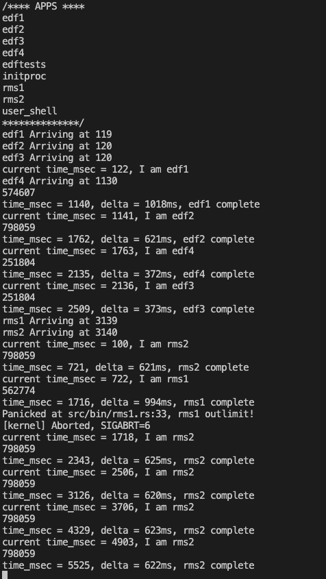

# Note
## run
```shell
make docker
# in docker
make run
```

update fail时：
```shell
rustup toolchain list
rustup toolchain uninstall <toolchain_name>
rustup toolchain install nightly
```

## task-manage
各个 trait 的接口可以参考 [task-manage readme](task-manage/README.md)

`schedule trait` 只使用任务`id`进行调度处理，`manage trait`是任务池的实现。

`Process`控制块的部分内容在[proc_rel.rs](task-manage/src/proc_rel.rs)(只有进程时)或者[proc_thread_rel.rs](task-manage/src/proc_thread_rel.rs)（有线程时）里。

通过修改[ch8/Cargo.toml](ch8/Cargo.toml)中的 feature 设置可以改变线程的启用：
```
rcore-task-manage = { path = "../task-manage", features = ["thread"]  }
```

[ch8/processor.rs](ch8/src/processor.rs)是带线程的调度器的实现。

给`manage trait`加回调 hook，复杂的调度数据结构维护在`schedule trait`中。可以在`feature`里尝试加入调度算法的 config 项。

## kernel-vm
页表相关处理内容，`PageManager trait` 在 [ch8/src/main.rs](ch8/src/main.rs) 中的`Sv39Manager`实现了。
`Sv39Manager`的`deallocate`没实现。

## fs相关
在`easy-fs/`和[ch8/src/fs.rs](ch8/src/fs.rs)中。
关于页面置换的部分在[easy-fs/src/block_cache.rs](easy-fs/src/block_cache.rs)中，其中的`BlockCacheManager`是当前适用的页面置换算法的示例。在`BlockCacheManager`的`get_block_cache`函数中实现了置换的控制。

目前的实现：
```rust
// substitute
if self.queue.len() == BLOCK_CACHE_SIZE {
    // from front to tail
    if let Some((idx, _)) = self
        .queue
        .iter()
        .enumerate()
        .find(|(_, pair)| Arc::strong_count(&pair.1) == 1)  // drop 了没有 proc 引用的 block
    {
        self.queue.drain(idx..=idx);
    } else {
        panic!("Run out of BlockCache!");
    }
}
```

## syscall 相关
所有的`syscall`的具体实现在[ch8/src/main.rs](ch8/src/main.rs)中可以找到。
`yield`的 syscall 没有实现(line 502)。
`syscall id`匹配的部分在[syscall/src/kernel/mod.rs](syscall/src/kernel/mod.rs)的`handle`函数里。`id`常量写在了[syscall/src/syscall.h.in](syscall/src/syscall.h.in)中，编译时根据此文件生成[syscall/src/syscalls.rs](syscall/src/syscalls.rs)。

## 另两个代码
调度：[https://git.tsinghua.edu.cn/masy18/rCore-Tutorial-v3.git](https://git.tsinghua.edu.cn/masy18/rCore-Tutorial-v3.git)
置换：[https://github.com/Clement5140/rCore-Tutorial-v3/tree/dev-PRA](https://github.com/Clement5140/rCore-Tutorial-v3/tree/dev-PRA)

### 调度
查对应算法的 branch 就行。一般来说是改了 `os/task/manager.rs`，然后在`user/src/bin`中添加了测试。
对于需要提供参数的任务（比如 Shortest Job First 要提供运行时间，周期性任务要提供运行时长和ddl），是修改了`exec`系统调用，增加了所需要的参数。

另外，他是用`sleep`模拟的长任务，但是调`syscall_sleep`的时候是`yeild`然后跑下一个。

#### 批处理系统
* SJF


* STCF


* HRRN


#### 交互式系统
* MQ （没找到）

* MLFQ


* Lottery


* Stride


#### 实时计算机系统
* RMS


* EDF




### 页面置换
`dev-PRA`分支上。`mm/frame_manager.rs`里是所有页面置换算法的实现，分为全局置换和局部置换两大类。
改`os/src/config.rs`的`CHOSEN_PRA`可以改选择的页面置换算法：
```rust
pub const PRA_IS_LOCAL: bool = true;  // 是否是全局置换算法
pub const CHOSEN_PRA: PRA = PRA::FIFO; //line 15
pub const PFF_T: usize = 100000;  // 缺页率参数
pub const WORKINGSET_DELTA_NUM: usize = 20; // 工作集参数
```

| 算法 | test1 | test2 | test3 | test4 | test5 | test6 | test7 |
| -- | -- | -- | -- | -- | -- | -- | -- |
| FIFO | 100 | 800 | 100 | 856 | 800 | 2400 | 3257 |
| Clock | 100 | 800 | 100 | 670 | 800 | 2400 | 3140 | 
| ClockImproved | 100 | 790 | 100 | 590 | 787 | 2402 | 3177 |
| PageFaultFrequency(100k) | 200 | 800 | 185 | 7177 | 816 | 3263 | 8965 |
| PageFaultFrequency(200k) | 175 | 800 | 200 | 5582 | 812 | 2689 | 失败 | 
| WorkingSet(5) | 200 | 800 | 200 | 7362 | 800 | 2958 | 9599 |
| WorkingSet(20) | 100 | 800 | 100 | 5406 | 800 | 2842 | 7700 | 

原测试结果：


## update
### problems
1. 这个 `xtask/src/fs_pack.rs` 跑的好慢 ... 